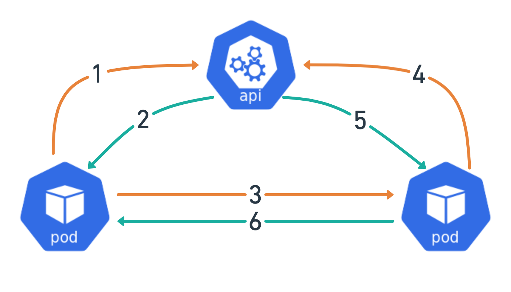

# Demo for Kubernetes TokenRequest API

This repo contains example deployment manifest and basic example services that use the TokenRequest and TokenReview APIs. This is a companion to the blog post here  `go-client` was intentionally not used to make building the demo services as easy as possible and not required any dependencies. 

1. Container makes request for a bound service account token via TokenRequest API. *In the demo I am using volume projection to handle the fetching of the token on my behalf which is not pictured*
2. API returns a token
3. `token-client` Pod makes service to service call to the `token-server` Pod
4. `token-server` Pod validates auth token in http request against the TokenReview API
5. API responds with validation data about the request token.
6. If token is valid `token-server` responds to `token-client` with request payload.

